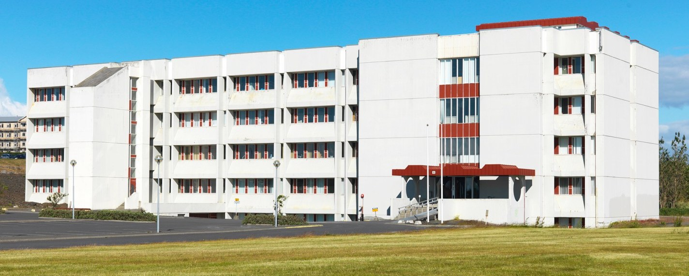

---
header:
  caption: ""
  image: ""
view: 3

---

<style>
body {
text-align: justify}
</style>

```{r, echo = FALSE, include = FALSE}
knitr::opts_chunk$set(echo = FALSE, out.width = "90%")
```


# Læknagarður

```{r}

```


```{r}
blogdown::shortcode("boka_laeknagardur")
```

Á skrifstofu okkar í Læknagarði fer almenna ráðgjöfin fram. Þar geta allir sem eru framhaldsnemendur eða akademískt starfsfólk Heilbrigðisvísindasviðs bókað tíma. Skrifstofa okkar er staðsett á þriðjuhæð í *stofu 331*.

* Þriðjudagar: 09:00 - 14:00
* Fimmtudagar: 09:00 - 14:00

***

# Íslensk Erfðagreining 

```{r}
knitr::include_graphics("decode.jpg")
```


```{r}
blogdown::shortcode("boka_decode")
```

Hér geta framhaldsnemendur og starfsfólk sem eru nú þegar til húsa í Íslenskri Erfðagreiningu bókað tíma. Ráðgjöfin er almennt séð staðsett hjá Miðstöð í Lýðheilsuvísindum en getur farið fram hvar sem er í byggingunni.

* Mánudagar: 09:00 - 14:00
